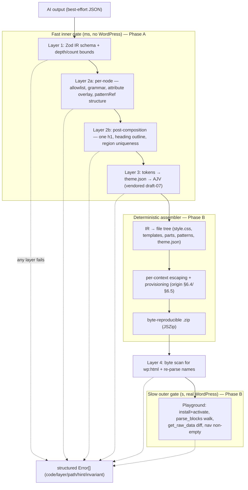
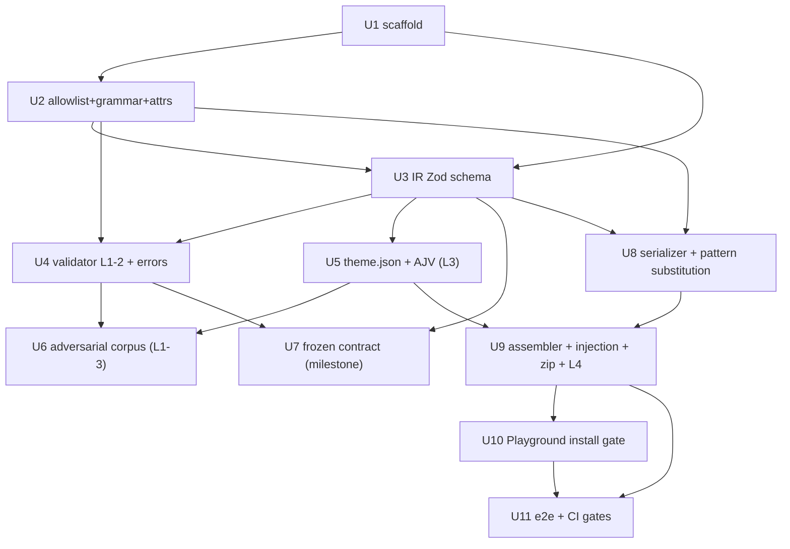

# feat: Track 1 correctness backbone

## Summary

Build the Track 1 "correctness backbone" of the WordPress Block Theme generator as a single phased deliverable: a typed intermediate representation (IR) the AI emits, a layered validator that enforces the three release-blocking invariants (zero Custom HTML block, zero hallucinated block names, valid `theme.json`), a deterministic assembler that turns a validated IR into a byte-reproducible installable `.zip`, and a headless WordPress Playground gate that proves the theme installs and activates cleanly. **Phase A** lands the schema, validator (layers 1–3), adversarial corpus, and the frozen contract that unblocks Track 3 (AI orchestration). **Phase B** lands the assembler, serializer, injection defenses, layer-4 scan, and the Playground install gate — the path to a downloadable theme. Built lean to the must-have bar; the heavier hardening (property-based tests, adversarial red-team, automated schema-drift job) is deferred to "What I'd Do Next" per the PRD's proportionality notes.

---

## Problem Frame

A naive "ask an LLM for a block theme" fails quietly: models smuggle structure into the Custom HTML block (the disqualifying escape hatch), hallucinate block names that round-trip through WordPress's permissive parser and surface only as `core/missing`, or emit `theme.json` whose unknown keys are silently dropped. None of these produce an activation error, so "it installed" is not "it is correct." This backbone is the contractual gate that makes the strategy's "trust the parser, not the prompt" real: the AI's output is untrusted, schema-validated input to a deterministic pipeline. It is the prerequisite every other track consumes — Track 3 generates against its frozen contract, Track 2 patterns are validated by it, Track 4 renders its structured errors. Full motivation, the resolved architectural questions, and all citations live in the origin PRD (see Sources & References).

---

## Requirements

- R1. **Typed IR contract** — a versioned IR schema (Zod, mirrored as a publishable JSON Schema) where the `blockNode` path is *type-incapable* of expressing a Custom HTML block (no `rawHtml` node, `core/html` absent from the allowlist enum, `additionalProperties: false` throughout), and `patternRef.params` safety is neutralization-at-substitution, not a type guarantee. (origin: docs/phase-1-prd.md §1.1, §2)
- R2. **Layered fail-closed validator** — accepts an IR and returns either a typed artifact or a structured error list, never a silent pass; achieves a 100% catch rate on the three invariant classes across the §5.3 adversarial corpus. The corpus is the *enumerated*-class guarantee; only the raw-`wp:html` class is universal (the layer-4 byte scan is near-exhaustive for it). The hallucinated-name and invalid-`theme.json` classes are bounded by the enumerated corpus until the deferred property-based layer lands — so "100%" means "100% on the enumerated classes," matching the origin §5.3 honesty boundary, not a corpus-only universal. (origin §1.2, §5, §5.3)
- R3. **Deterministic assembler** — maps a validated IR to a byte-reproducible `.zip` (same IR in, same bytes out, any machine). (origin §1.3, §6)
- R4. **Install/activate harness** — installs the `.zip` into a clean WordPress and asserts zero activation errors, zero `core/missing`, zero `core/html`, zero undelimited-HTML chunks, zero dropped `theme.json` keys, and non-empty `core/navigation`. (origin §1.4, §7)
- R5. **Frozen Track 3 contract** — the IR JSON Schema, the block-name allowlist, and the structured error format are published as the interface Phase 2 codes against. (origin §1.5, §8)
- R6. **Zero Custom HTML block** — the disqualifying constraint, enforced in depth: type shape (blockNode) + validator (layer 4 byte scan) + render gate (Playground `parse_blocks` walk). (CLAUDE.md hard constraint; origin §2.2, §5.1, §7.2)
- R7. **Per-output-context injection defense** — block text, URL attributes, `style.css` headers, `theme.json` token values, `patterns/*.php` bodies, and archive paths each get the correct escape/validation transform at assembly time. (origin §6.4; brief "handling user-provided strings")
- R8. **Clean test story** — `npm install && npm test` runs with zero setup friction; at least one end-to-end integration test covers IR → validate → assemble → zip → install gate. (brief quality bar)

**Origin actors:** the IR's consumers — Track 3 (AI orchestrator, codes against R5's contract), Track 2 (pattern library, validated by R2), Track 4 (UI, renders R2's structured errors). This plan *names* these seams; it does not build those tracks.
**Origin flows:** validated-IR → assembled-`.zip` → install-gate is the spine; the adversarial-corpus → CI gate proves the invariant.

---

## Scope Boundaries

- **Track 2 pattern content** — this plan consumes the 3 seed patterns as fixtures and defines the `meta.json` interface the assembler reads; it does not author new patterns.
- **Track 3 orchestration internals** — prompt construction, retry policy, model selection. This plan publishes the contract Track 3 targets (R5) and names the input-stage trust boundary (user text as an isolated data slot), nothing more.
- **Track 4 UI** beyond a minimal Next.js skeleton — the input form, error rendering, and download UX are Track 4. This plan establishes the server-side pipeline they will call.
- **The distinctiveness / visual-quality axis** — this backbone guarantees *structural* correctness only. A valid IR can describe a boring theme; distinctiveness is Track 2's burden. (origin §1 "what Phase 1 deliberately does not guarantee")

### Deferred to Follow-Up Work

- **Track 2 pattern-breadth push** (~8–12 patterns, up from the 3-pattern seed): the highest-leverage follow-on per the just-settled effort-allocation decision (origin §"Deferred / Open Questions" #1). A separate plan once this backbone freezes the contract.
- **`core/media-text` / `core/gallery` allowlist additions**: admitted as a byproduct when Track 2 builds the photographer-portfolio patterns that use them, paying the per-block §4.2/§6.2 cost then — not pre-admitted (origin §4.1; settled decision #2).
- **Property-based test layer + adversarial red-team** (the universal form of the catch invariant) and the **automated `theme.json` schema-drift detector**: Phase-4 / "What I'd Do Next" per the origin's proportionality note (origin §1, §5.3 Q10, §3.3).
- **WP-version matrix in CI** (Q9 option B): the MVP ships a single pinned 6.6 target with honest `style.css` version headers; the matrix escalates only if real installs show cross-version invalidation (origin §9 Q9).

---

## Context & Research

### Relevant Code and Patterns

- **Greenfield repo** — no `package.json`, `tsconfig`, or `src/` exists. `.gitignore` is already Node/Next-aware and ignores `generated/` and `*.zip` (so assembler output belongs in `generated/`) and `Logs/*` except `.gitkeep`. No `.nvmrc`, no `.github/` CI yet. `CLAUDE.md` is the sole agent-context file (no `AGENTS.md`).
- **Seed pattern library** at `docs/pattern-library/{hero-cover,query-loop-list,site-footer}/` — each is `pattern.html` (valid native markup, zero `wp:html`, Playground-validated) + `meta.json`. The `meta.json` shape is **non-uniform**: a common spine (`name`, `title`, `region`, `validRegions`, `blocksUsed`, `tokensAccepted:{color,fontSize,spacing}`, `parameterizable:{...}`, `locked:[...]`, `compositionRules:{...}`) with per-pattern divergence — hero adds `parameterizationRules` (the `dimRatio`↔background-image conditional) and `parameterizable.media`/`structuralKnobs`; query-loop has `queryKnobs`/`layoutKnobs` and `requiresDynamicContext`; footer has `isTemplatePart`. **Critical:** there are no positional `{{slot}}` markers in `pattern.html` — `parameterizable` is a *category grouping of editable surfaces*, `locked` is a *string array of structural invariants*. The assembler must do structured, category-based substitution (map IR fields → block attributes), not string-replace. See Key Technical Decisions and U8.
- **`docs/pattern-library/README.md`** — authoritative for the token vocabulary (color `base/contrast/primary/secondary`; fontSize `small`→`xxx-large`; spacing `30`–`80`), the de-facto allowlist (union of the 3 patterns = the MVP allowlist seed), the four cross-pattern composition invariants (one-h1, `post-*` context-binding, region uniqueness, site-data provisioning), and the validation gotcha: **render the frontend, not the editor canvas** (the editor misrenders query grids).
- **`docs/pattern-library/IR-notes.md`** — the forcing-function findings already folded into the PRD: static-node vs template-region distinction, token-references-resolve-against-vocabulary, grammar-not-flat-allowlist, parameterizable-vs-locked, site-data provisioning, two-layer validation, typed `query` config + style variations, and inter-slot conditional rules (`dimRatio`↔image).

### Institutional Learnings

- **None found** — `docs/solutions/` does not exist and the cross-project brain returned zero hits for every technical query (Zod/IR, AJV, deterministic zip, prompt-injection, Playground). This is the first implementation pass; treat it as a clean slate. After this lands, capture the real learnings (Zod recursion-bound surprises, AJV draft-07 gotchas, byte-reproducible-zip pitfalls, Playground-in-CI flakiness, `@wordpress/blocks` `serialize()` running headless in Node) via `/ce-compound`.

### External References

- Skipped fresh external research: the origin PRD is itself a citation-dense research artifact (~1 day old, every WordPress/SDK fact pinned by commit). Re-researching the `theme.json` schema, `block.json`, Playground CLI, and provider structured-output limits would duplicate the PRD's §10 citations. See origin §10 for the authoritative source list.

---

## Key Technical Decisions

All carried from the origin PRD's resolved decision logs (8/10 questions resolved there; Q7 resolved by the Phase 2 PRD). Cited, not re-derived.

- **IR shape = hybrid** (`node = oneOf[blockNode, patternRef]`): `patternRef` is the default authoring mode for covered regions; constrained `blockNode` free-tree is reserved for uncovered gaps. (origin §2.3, Q1)
- **Recursive-tree enforcement = post-hoc validation** (Q7 → Option C, resolved by [`docs/phase-2-prd.md`](../phase-2-prd.md) §3): `generateObject` strict-validates the flat IR *envelope*; the recursive `content` is best-effort JSON enforced by the layer-1 validator, never at generation time. The validator is authoritative regardless — exactly "trust the parser." The recursive `blockNode` shape stays frozen; only the encoding is provisional pending the Phase 2 §3.6 experiment. (origin §8.1)
- **Node-kind made explicit** (`static` vs `template-region`): per IR-notes #1, the IR carries an explicit node-kind rather than leaving it implicit in `query`→`post-template` containment, so the assembler knows which subtrees render per-item. (origin §2.4 sub-surfaces)
- **Validation authority = standalone allowlist + containment grammar** (fast inner gate, milliseconds, no WP boot) + **Playground `parse_blocks()` as the authoritative outer backstop**. Not a dependency on `@wordpress/blocks`' editor registry. (origin §4.2.1, Q3)
- **`theme.json` schema = vendored upstream draft-07**, pinned by commit, validated with AJV + `ajv-formats`. Not hand-authored, not generated from `theme-i18n.json`. Emit `version: 3` against the matching schema. (origin §3.1, Q2)
- **Attribute schema = `block.json` key/type extraction at build time + a thin hand-authored value-range overlay** (`heading.level ∈ 1..6`, `cover.dimRatio ∈ 0..100`) + URL safe-scheme check. (origin §4.2, Q8)
- **Serializer parity oracle = JS `@wordpress/blocks` `serialize()`** (which runs each block's `save()`), **not PHP `serialize_block()`** (which only re-wraps stored `innerHTML`). Covered regions arrive as pre-serialized pattern blobs (substitution, no per-attribute serialization); byte-parity is only needed for the small free-tree gap-filler set. (origin §6.2, Q6)
- **Pattern substitution = structured, category-based.** The seed `meta.json` declares `parameterizable` surfaces by category (content/tokens/knobs) and `tokensAccepted` slugs; there are no positional markers. The assembler resolves token-ref slots to typed values and maps them onto the pattern's block attributes — never string-replace into the blob (which would reopen the injection surface). (origin §6.2, §6.4 last row)
- **`patternRef.params` is a typed, category-tagged slot map — and that category discriminator is frozen in Phase A** (deepening: architecture + security review). The origin §2.4 leaves `params` an opaque `{ "type": "object" }`, but both layer-2a validation (U4) and per-slot escaping (U8) are *category-dependent* — a `tokenRef` slot resolves to a vocabulary slug (no escaping), a `text` slot is HTML-encoded, a `url` slot gets safe-scheme validation, a `scalar` knob is range-checked. So `params` is frozen as `Record<slotName, { kind: 'tokenRef' | 'text' | 'url' | 'scalar', value }>`: the **kind discriminator is pinned in the U7 contract** (Track 3 can construct valid `params`; U4 can validate them; U8 knows which transform to apply), while only the slot→block-attribute *targeting* convention stays a Track 2 detail. This mirrors the Q7 freeze-qualification (envelope frozen, encoding provisional) and prevents the first parameterization-aware Track 2 pattern from reshaping `params` — which would be a contract break U7 promises Track 3 it will not make.
- **Install harness = WordPress Playground `run-blueprint`** (headless wasm, no Docker, honors the standalone constraint), pinned WP 6.6 / PHP 8.2; the four `runPHP` assertions are the real gate. (origin §7.2, Q5)
- **Structured error format = both-layered, frozen field set**: `code` (closed enum), `layer`, `path`, `message`, nullable `invariant`, optional bounded `hint` (≤200 chars, no schema fragments). Consumed by Track 3 (retry) and Track 4 (display); raw AJV/validator internals never leak. (origin §5.2, §8.3, Q4)
- **WP-version coverage = single pinned 6.6 target** for the MVP, declared honestly in `style.css` headers (Q9 lean A). (origin §9 Q9)
- **Invariant proof = curated adversarial corpus** as the per-PR deterministic gate (MVP scope); the universal property-based layer and red-team are deferred (Q10). (origin §5.3)

---

## Open Questions

### Resolved During Planning

- **Plan scope (full backbone vs frozen-contract slice):** resolved with the user → one phased plan covering the full backbone through to a downloadable `.zip`, with the frozen-contract milestone (U7) as an explicit phase boundary so Track 3 can begin in parallel.
- **Effort allocation / allowlist ceiling / contract freeze:** the three origin deferred questions, settled (see Scope Boundaries → Deferred, and the origin §"Deferred / Open Questions" resolution stamps committed at `80749b5`).

### Deferred to Implementation

- **Pattern slot→attribute *targeting* convention (the only `params` detail still open).** The `params` *shape* — a category-tagged slot map with a frozen `kind` discriminator — is settled and part of the U7 contract (see Key Technical Decisions). What remains deferred is how a slot *names its target*: the mechanism by which the assembler locates which block+attribute inside a `pattern.html` blob a given slot fills (e.g. a `meta.json` field naming `{blockIndex|selector, attribute}` per declared slot). The seed patterns have no positional markers, so this firms up when Track 2 authors patterns *with* parameterization in mind. Settle at implementation against the seed patterns first; it does not reopen the frozen `params` shape.
- **`@wordpress/blocks` `serialize()` headless in Node.** Whether the JS serializer oracle runs cleanly in a Node/Vitest context or needs a DOM shim (jsdom) is an execution-time discovery — confirm when U8 lands; if it needs a browser-ish environment, the parity test runs under a jsdom Vitest environment.
- **Per-PR seeded fuzz vs nightly** for the corpus: a non-architectural sub-decision left to implementation (origin §5.3 decision log).
- **Exact `core/navigation` fallback mode** (`overlayMenu` page-list vs provisioned default menu): U9 picks one at implementation; the contract is "renders non-empty without a stored menu entity" (origin §6.5).

---

## Output Structure

```
package.json  tsconfig.json  .nvmrc  vitest.config.ts  next.config.mjs  .env.example
.github/workflows/ci.yml
src/
  ir/
    schema.ts            # Zod IR schema (origin §2.4) — the typed contract
    types.ts             # host-language type mirror for the assembler
    json-schema.ts       # publishable JSON Schema (the Track 3 artifact)
  blocks/
    allowlist.ts         # ~30-block allowlist — single source of truth
    grammar.ts           # containment grammar (origin §4.2)
    attributes.ts        # attribute schemas: block.json extract + value-range overlay
    block-json.ts        # build-time block.json key/type extraction
  validator/
    index.ts             # layer orchestration, fail-closed, ordered
    layer1-schema.ts     # Zod parse + depth/count bounds
    layer2-blocktree.ts  # 2a per-node (allowlist/grammar/attrs) + 2b post-composition
    layer3-themejson.ts  # token compile + AJV against vendored schema
    layer4-scan.ts       # assembled-artifact wp:html byte scan + re-parse
    errors.ts            # structured error format (origin §5.2)
  themejson/
    compile.ts           # design tokens → theme.json object (origin §3)
    schema/theme-v3.json # vendored upstream draft-07 schema, pinned by commit
  assembler/
    index.ts             # validated IR → file tree → .zip
    serializer.ts        # blockNode → canonical markup (parity-checked)
    patterns.ts          # patternRef → markup via structured substitution
    style-css.ts         # style.css header emission
    escaping.ts          # per-output-context injection defenses (origin §6.4)
    provisioning.ts      # site-data provisioning (origin §6.5)
    zip.ts               # deterministic JSZip packaging
  harness/
    blueprint.ts         # Playground blueprint + runPHP gate assertions
    run.ts               # @wp-playground/cli runner, vfs zip write
contract/                # published frozen contract for Track 3 (U7)
  ir-v1.schema.json  allowlist.json  error-format.md
fixtures/                # §5.3 adversarial corpus (data)
  wp-html/  hallucinated/  invalid-themejson/  positive/{blog,portfolio,landing}/
app/                     # minimal Next.js App Router skeleton (server seam for Track 4)
tests/
  corpus.test.ts         # runs the adversarial corpus, asserts exact code+invariant
  e2e/                   # Playwright + end-to-end pipeline integration test
```

---

## High-Level Technical Design

> *This illustrates the intended approach and is directional guidance for review, not implementation specification. The implementing agent should treat it as context, not code to reproduce.*

The pipeline is a fixed-order, fail-closed gate. Each layer is a pure function `input → Result<output, Error[]>`; cheap structural checks gate expensive ones. The frozen-contract milestone (after layer 1–3 + corpus) is where Track 3 can begin.



---

## Implementation Units

Dependency graph (U-IDs are stable; reordering or splitting never renumbers):



**Phase A — Foundation & frozen contract** (origin brief-Phase-1; ends at U7, which unblocks Track 3): U1–U7.
**Phase B — Assembly & install gate** (origin brief-Phase-3; ends at a downloadable, install-verified `.zip`): U8–U11.

Execution posture across the plan: **test-first** for the validator, serializer-parity, and assembler units — the §5.3 corpus is the acceptance gate and the catch invariant is release-blocking, so behavior is pinned by tests before/while code lands. Carried as per-unit `Execution note`s.

### U1. Project scaffold & toolchain

**Goal:** A booting Node/TS/Next.js project where `npm install && npm test` runs clean with zero setup friction, plus the dependency set and CI skeleton the rest of the plan needs.

**Requirements:** R8

**Dependencies:** None

**Files:**
- Create: `package.json`, `tsconfig.json` (strict), `.nvmrc` (Node 20), `vitest.config.ts`, `next.config.mjs`, `.env.example`, `.github/workflows/ci.yml`, `app/page.tsx` (placeholder), `src/index.ts` (placeholder)
- Test: `tests/smoke.test.ts`

**Approach:**
- Install per ADR-0001: `next`, `react`, `react-dom`, `typescript`, `zod`, `ajv`, `ajv-formats`, `jszip`, `@wordpress/blocks`, `@wordpress/block-library`, `@wp-playground/cli`, `ai` + `@ai-sdk/anthropic`, `vitest`. npm (commit `package-lock.json`); local bun is fine but the manifest must be npm-clean. **Two pins are load-bearing (doc-review: feasibility):** (1) `@wordpress/blocks` peer-requires **React 19** (`react@^19.2.4`, via `@wordpress/element`/`react-dom/server` for the U8 `serialize()` oracle), so pin React 19 + react-dom 19 + a Next.js version that accepts React 19 (Next 15/16, peer `^18.2.0 || ^19.0.0`) — pairing with React 18 / Next 14 aborts `npm install` with ERESOLVE and breaks R8's zero-friction promise. (2) Pin `@wordpress/blocks` to an **exact** version (no caret): U8's serializer parity and U9's byte-reproducibility are defined by its `save()` output, so a caret-range bump silently changes canonical bytes and fails the U9 golden file (doc-review: adversarial). Assert a clean, non-forced `npm install` (no `--legacy-peer-deps`) in verification.
- `@wordpress/block-library` is the source for U2's `block.json` extraction — `@wordpress/blocks` itself ships **zero** `block.json` files; the core block attribute definitions live in `block-library` (doc-review: feasibility + scope). Pin it to the same commit/version as the U5 vendored `theme.json` schema so block attrs and `theme.json` stay version-coherent.
- `tsconfig` strict mode (the typed-contract discipline the strategy depends on). Scripts: `test` (vitest), `typecheck` (tsc --noEmit), `lint`. `@playwright/test` and its `npx playwright install` browser-binary step are added in U11 (where the only e2e tests live) — installing them upfront adds idle install friction across all of Phase A against R8 (doc-review: scope).
- CI workflow skeleton with a fast job (typecheck + vitest) running on all PRs; the slow Playground job is added in U11. CI runner secrets (`ANTHROPIC_API_KEY`) masked at the runner level, never echoed to logs (doc-review: security).
- The minimal Next.js skeleton is the ADR-0001-mandated framework + the server-side key-handling seam (the AI key never reaches the client) — it is traced to ADR-0001, not to an R-ID, and stays minimal until Track 4 builds on it.
- Do **not** bake "Automattic" into the package name — leave a product-name TODO (CLAUDE.md candidates: Blocksmith et al.). `.env.example` carries `ANTHROPIC_API_KEY=` only; never commit a real `.env`.

**Execution note:** Scaffolding; the smoke test only proves the harness runs.

**Test scenarios:**
- Happy path: `tests/smoke.test.ts` asserts a trivial truthy expectation so `npm test` exits 0 on a clean clone.
- Verification of toolchain: `npm run typecheck` passes on the placeholder sources.

**Verification:**
- Fresh `npm install && npm test` succeeds with no "install X first" step; `npm run typecheck` is clean; CI fast job is green.

### U2. Block allowlist + containment grammar + attribute overlay

**Goal:** The §4 module — the single source of truth for which blocks exist, how they may nest, and what attribute values are legal. This is the heart of the hallucination + containment invariants.

**Requirements:** R1, R2, R6

**Dependencies:** U1

**Files:**
- Create: `src/blocks/allowlist.ts`, `src/blocks/grammar.ts`, `src/blocks/attributes.ts`, `src/blocks/block-json.ts`
- Test: `src/blocks/allowlist.test.ts`, `src/blocks/grammar.test.ts`, `src/blocks/attributes.test.ts`

**Approach:**
- `allowlist.ts`: the ~30-block MVP set exactly as origin §4.1 enumerates (layout/structure, content leaves, site/FSE, query-loop family). Exported as a typed const that U3 compiles into the IR schema's `block` enum — one source of truth, kept reconciled with the pattern library's `blocksUsed`.
- `grammar.ts`: the containment map from the origin §4.2 table (`column ∈ columns`, `post-template ∈ query`, `post-* ` ancestor `query→post-template`, `button ∈ buttons`, `list-item ∈ list`, `query-pagination-* ∈ query-pagination`). Encodes parent/ancestor/allowed-children rules WordPress only enforces in the inserter.
- `block-json.ts`: build-time extraction of the key/type surface from core `block.json`. **Source = the pinned `@wordpress/block-library` dependency** (doc-review: feasibility + scope) — `@wordpress/blocks` ships no `block.json`, so reading from `block-library`'s installed files (or vendoring the ~30 needed files under `src/blocks/vendor/` pinned to the same commit) is the concrete mechanism, not an unspecified "core block.json." `attributes.ts`: the extracted surface + a hand-authored value-range overlay (`heading.level ∈ 1..6`, `cover.dimRatio ∈ 0..100`, `columns.align ∈ {wide,full}|absent`, `query.query.postType ∈ registered`) + URL safe-scheme allowlist (`https/http/mailto/tel`; reject `javascript:`/`data:`) keyed by block+attribute. `tokensAccepted` from the pattern `meta.json` is checked here too.

**Execution note:** Test-first — the corpus's hallucinated-name and containment cases (U6) target this module; pin behavior with tests as it lands.

**Patterns to follow:** origin §4.1/§4.2 tables; pattern-library README de-facto allowlist; the `core/heading` `block.json` inspection in origin §4.2 (typed attrs, no `level` range — proves the overlay is needed).

**Test scenarios:**
- Happy path: every block in the 3 seed patterns' `blocksUsed` is a member of the allowlist (drift guard).
- Edge case: `core/column` allowed only under `core/columns`; a `core/column` at region root is rejected by the grammar. Covers F: containment.
- Edge case: `post-*` leaf accepted only inside a `query → post-template` ancestry; rejected elsewhere.
- Error path: `heading.level: 7` rejected (overlay range); `cover.dimRatio: 150` rejected.
- Error path: `core/button.url: "javascript:alert(1)"` rejected by safe-scheme check; `https://…` accepted.
- Error path: unknown attribute key on a block rejected (not silently passed).
- Edge case: `core/html`, `core/shortcode`, `core/freeform`, and any third-party namespace are absent from the allowlist (never admitted).

**Verification:**
- The allowlist, grammar, and overlay are pure data + pure functions, importable with no IR dependency; all seed-pattern blocks pass; the negative cases above reject with a precise offending-node identification.

### U3. IR schema (Zod) + publishable JSON Schema

**Goal:** Encode the origin §2.4 IR as a Zod schema (the contract `generateObject` consumes and the validator enforces), mirrored as a host-language type and a publishable JSON Schema.

**Requirements:** R1, R5

**Dependencies:** U1, U2

**Files:**
- Create: `src/ir/schema.ts`, `src/ir/types.ts`, `src/ir/json-schema.ts`
- Test: `src/ir/schema.test.ts`

**Approach:**
- Envelope: `irVersion: const 1`, `theme` (slug `^[a-z][a-z0-9-]{1,39}$`, title, author, description, `wpVersionTarget: "6.6"`), `tokens` (design-token set), `regions` (closed `kind`/`name` enums, `content: node[]`).
- `node` is a **discriminated union, not a bare `oneOf`** (doc-review: adversarial). Discriminate on an explicit tag (or assert exactly-one-match semantics) so an adversarial-but-parseable object — one carrying *both* a `block` and a `pattern` key, or a near-`patternRef` with an extra key — is rejected deterministically rather than silently coerced into the wrong arm (which would skip the layer-2a `patternRef`-resolution check and reach the assembler mis-typed). This matters specifically because under the Q7 Option C decision the recursive `content` arrives as best-effort untyped JSON, so node-discrimination falls entirely on layer-1 parsing and must be unambiguous by construction. `blockNode`: `block` = the U2 allowlist enum (not a free string), `attributes` object (bounded in layer 2), `text` maxLength 2000, `innerBlocks` maxItems 32. `patternRef`: `pattern` slug, and `params` as a **typed, category-tagged slot map** (`Record<slotName, { kind: 'tokenRef' | 'text' | 'url' | 'scalar', value }>`) — not an opaque object. The `kind` discriminator is part of the frozen contract (see Key Technical Decisions); it is what lets U4 validate `params` and U8 apply the right escape per slot. The slot→block-attribute targeting convention is the only `params`-related detail left to Track 2 (Open Questions).
- `additionalProperties: false` everywhere (no invented `rawHtml`/`customCss`/`shortcode` key). Explicit **node-kind** (`static` vs `template-region`) per the carried decision. Typed `query` sub-object (`perPage/orderBy/order/postType/inherit` bounded). Token references (slot → vocabulary slug) and named style-variation vocabulary.
- `json-schema.ts`: emit the publishable JSON Schema (the §8.1 artifact) from the Zod schema (or a hand-mirrored draft-2020-12). Note the envelope/recursive-tree split for Track 3 (carried Q7 decision).

**Execution note:** Test-first — the schema-layer corpus cases (U6) pin this.

**Patterns to follow:** origin §2.4 abridged schema (the three load-bearing properties); IR-notes #1/#7 (node-kind, typed query, style variations).

**Test scenarios:**
- Happy path: a representative blog IR (hero `patternRef` + query-loop + footer) parses and types correctly.
- Edge case: an IR introducing a `rawHtml` key is rejected by `additionalProperties: false`.
- Edge case: `block: "core/hero-section"` (not in enum) rejected at schema layer (never reaches block-tree).
- Edge case: `innerBlocks` with 33 items rejected (`maxItems`); `text` of 2001 chars rejected.
- Edge case: a node nested past depth 10 rejected by the bound (also enforced in U4 layer 1 pre-walk).
- Happy path: a `patternRef` and a `blockNode` are both accepted in a `content` slot (oneOf).
- Edge case: a `patternRef.params` entry with a valid `kind` (`tokenRef`/`text`/`url`/`scalar`) parses; an entry with an unknown or missing `kind` is rejected (the category discriminator is enforced, not optional).
- Error path: an ambiguous node carrying *both* `block` and `pattern` keys is rejected with a single deterministic code — not silently coerced to either arm; a near-`patternRef` with an extra key is rejected by `additionalProperties: false` rather than falling through to `blockNode`.
- Edge case: a `template-region` node-kind round-trips and is distinguishable from `static`.

**Verification:**
- The Zod schema imports U2's allowlist as its `block` enum (one source of truth); the published JSON Schema validates the same fixtures; an implementer can hand the JSON Schema to Track 3 unchanged.

### U4. Validator layers 1–2 + structured error format

**Goal:** The fail-closed, ordered validator core that owns the hallucinated-block and containment invariants and emits the dual-consumer structured error list.

**Requirements:** R2, R5, R6

**Dependencies:** U2, U3

**Files:**
- Create: `src/validator/index.ts`, `src/validator/layer1-schema.ts`, `src/validator/layer2-blocktree.ts`, `src/validator/errors.ts`
- Test: `src/validator/layer1-schema.test.ts`, `src/validator/layer2-blocktree.test.ts`, `src/validator/errors.test.ts`

**Approach:**
- `index.ts`: define the **complete four-layer orchestrator interface** in fixed order, each layer `input → Result<output, Error[]>`; a failing layer short-circuits with its error list (fail-closed). Layer 3 (U5) and layer 4 (U9) plug into this same orchestrator — their *slots and error codes are declared here*, in Phase A, even though their implementations land later, so the orchestrator contract and the error-code enum are whole at the U7 freeze and do not grow in Phase B (deepening: architecture review — a frozen enum that gains codes later is silent contract drift). This is not speculative over-building (doc-review: scope): the layer-4 codes are mechanically derivable from its two *fixed* invariants — raw-`wp:html`-found and unresolved-block-name — so the complete enum is knowable now, not guessed.
- Layer 1 (`layer1-schema.ts`): parse + validate against the U3 Zod schema; enforce max nesting depth (≤10) and total node count *before* per-node processing (the resource-exhaustion bound, origin §2.4 #4).
- Layer 2a: walk the tree — allowlist membership (U2), containment grammar (U2), attribute schema + value ranges + URL scheme (U2); for a `patternRef`, confirm the referenced pattern resolves against the Track 2 catalog and its own structure is intact.
- Layer 2b: post-composition document invariants no single node guarantees — exactly one `h1` per page, heading-outline sanity, region uniqueness (one hero, one footer), **and dangling-token-reference resolution**: every token reference in the tree (e.g. `var:preset|color|brand`) must resolve against the palette declared in the IR `tokens` envelope; an unresolved reference is the "invalid-but-parseable" silent-failure class this backbone exists to catch (origin §2.4 sub-surfaces; IR-notes #2 — added in deepening, it had fallen through the unit map). (origin §5.1; IR-notes #6)
- `errors.ts`: the frozen field set — `code` (closed enum **spanning all four layers**, including the layer-4 raw-`wp:html`/unresolved-name codes whose *implementation* lands in U9), `layer`, `path` (e.g. `templates/index.html › core/query › core/scroll-spy`), `message`, nullable `invariant`, optional `hint` (≤200 chars, no schema fragments). Never includes raw AJV/validator internals.

**Execution note:** Test-first — drive each layer from the corpus's exact `(input, expected code+invariant)` pairs.

**Patterns to follow:** origin §5.1 (layered/ordered/fail-closed), §5.2 (error format example), §8.3 (must-not-leak boundary).

**Test scenarios:**
- Happy path: a valid blog IR passes layers 1–2 and yields a typed artifact, no errors.
- Error path: malformed JSON / missing required field → layer-1 error, `code` schema-class.
- Error path: `core/scroll-spy` → layer-2a `BLOCK_NOT_ALLOWED`, `invariant: hallucinated-block-name`, `path` naming the node.
- Error path: `core/column` at region root → layer-2a containment error with the offending path.
- Error path: two `h1`s (two patterns each claiming `level:1`) → layer-2b region/outline error (passes 2a, fails 2b — proves both passes are needed).
- Edge case: an IR with a `patternRef` to an unknown slug → 2a `patternRef`-resolution error.
- Error path: a node referencing token `var:preset|color|brand` with no `brand` in the IR `tokens` palette → layer-2b dangling-token-reference error (the invalid-but-parseable case).
- Error path: a `patternRef.params` entry whose declared `kind` does not match its target slot's category (e.g. a `text` value where the pattern declares a `tokenRef` slot) → layer-2a error (validated in Phase A, not deferred to U8 assembly).
- Error path: depth-12 nested IR → layer-1 bound error before per-node work.
- Assertion shape: every negative asserts the exact `code` and `invariant`, and the error object carries no AJV internals (boundary test).

**Verification:**
- The orchestrator returns `Result<artifact, Error[]>`, never throws on bad input and never silently passes; error objects match the frozen field set exactly.

### U5. theme.json compilation + vendored schema + AJV (layer 3)

**Goal:** Compile design tokens to a `theme.json` object and validate it against WordPress's published draft-07 schema; owns the invalid-`theme.json` invariant.

**Requirements:** R2, R7

**Dependencies:** U3

**Files:**
- Create: `src/themejson/compile.ts`, `src/validator/layer3-themejson.ts`, `src/themejson/schema/theme-v3.json` (vendored, pinned)
- Test: `src/themejson/compile.test.ts`, `src/validator/layer3-themejson.test.ts`

**Approach:**
- Vendor `schemas/json/theme.json` from Gutenberg (pinned commit SHA, never floated); it is draft-07, ~94KB, consumable by AJV as-is. Commit a SHA-256 of the vendored file alongside it and assert it at build time (doc-review: security) — guards against both fetch substitution and in-tree tampering of the committed schema.
- `compile.ts`: design tokens (colors, typography, spacing) → a `theme.json` object, `version: 3`. Emit `settings.typography.defaultFontSizes: false` / `settings.spacing.defaultSpacingSizes: false` whenever the tokens reuse core slugs (else v3 silently drops them — origin §3.2).
- `layer3-themejson.ts`: validate the compiled object with AJV + `ajv-formats` (`uri`/`color`). Plus per-category token *value* validation (the §6.4 layer-3 row): hex-color regex, number+unit for sizes, font-family safe-list — reject `#f00; } body{…}`-style CSS injection via token values.

**Execution note:** Test-first — the invalid-`theme.json` corpus cases pin this.

**Patterns to follow:** origin §3.1/§3.2 (vendored draft-07, version pair), §5.1 layer 3, §6.4 token-value row.

**Test scenarios:**
- Happy path: a valid token set compiles to a `version: 3` `theme.json` that passes AJV.
- Error path: unknown top-level key → AJV rejects (the silent-drop hazard caught up front).
- Error path: `version: 2` against the v3-pinned schema → rejected (the version-pair trap, origin §3.2).
- Error path: a setting key typo (`colour`) and a malformed color value → rejected.
- Error path: a custom preset reusing a core slug without the default-disable flag → rejected.
- Error path: a token color value `#f00; } body{ background:url(x) }` → rejected by hex-color validation (CSS-injection vector).
- Happy path: tokens reusing core slugs compile *with* the `defaultFontSizes/defaultSpacingSizes: false` flags present.

**Verification:**
- The vendored schema is pinned by SHA; a fixture token set round-trips to valid `theme.json`; the negative cases reject with layer-3 `code`/`invariant: invalid-theme-json`.

### U6. Adversarial fixture corpus (layers 1–3)

**Goal:** Turn the 100% catch invariant from a claim into a CI gate — the falsifiable corpus of `(input, expected outcome)` pairs across the three invariant classes plus a must-pass positive set.

**Requirements:** R2, R6, R8

**Dependencies:** U4, U5

**Files:**
- Create: `fixtures/wp-html/`, `fixtures/hallucinated/`, `fixtures/invalid-themejson/`, `fixtures/positive/{blog,portfolio,landing}/`
- Test: `tests/corpus.test.ts`

**Approach:**
- Encode the origin §5.3 corpus exactly. **`wp:html` — two outcomes:** *must reject* (a `core/html` node; a `patternRef` whose resolved body contains `wp:html`; raw `<!-- wp:html` with whitespace/casing tricks — the layer-4 cases are added in U9). *Must neutralize* (a `text` field containing `"<!-- wp:html -->…"` or raw `<script>` — passes validation, renders as literal; a fixture asserting rejection here would wrongly forbid a blog post *about* the HTML block).
- **Hallucinated names** (reject): `core/hero`, `core/scroll-spy`, `core/testimonial`; real-but-excluded `core/embed`/`core/shortcode`; valid-name-invalid-position (`core/column` at root); unknown attribute keys; `heading.level: 7`.
- **Invalid `theme.json`** (reject): unknown key; `version: 2`; `colour` typo; malformed color; core-slug-reuse without the flag.
- **Positive set:** one IR per archetype (blog, photographer portfolio, landing) exercising query loops, cover heroes, columns, navigation, template parts — these pass layers 1–3 here and run end-to-end through Playground in U11.
- Each negative asserts the exact `code` and `invariant` tag (a regression that changes *which* error fires is caught).

**Execution note:** This unit *is* the acceptance test suite — author the fixtures and assertions first; they are the red bar U2–U5 turn green.

**Patterns to follow:** origin §5.3 (the enumerated corpus and the reject-vs-neutralize split).

**Test scenarios:**
- Each negative fixture: asserted rejected with its exact `code` + `invariant`.
- Each neutralize fixture: asserted *passes* validation (rendered-literal proven later by layer 4 finding no raw delimiter).
- Each positive fixture: asserted passes layers 1–3 with zero errors.
- Meta: a single uncaught negative *in the enumerated corpus* fails CI (the falsifiable form of "below 100% on the enumerated classes is release-blocking" — not a claim that the corpus proves the universal; the universal for the hallucinated-name and invalid-`theme.json` classes arrives with the deferred property layer).

**Verification:**
- `tests/corpus.test.ts` is green; flipping any validator behavior turns a specific corpus case red with a clear diff.

### U7. Frozen contract publication (Phase A milestone)

**Goal:** Publish the IR JSON Schema, the block allowlist, and the structured error format as the stable interface Track 3 codes against — the milestone that unblocks Phase 2 to start in parallel.

**Requirements:** R5

**Dependencies:** U3, U4

**Files:**
- Create: `contract/ir-v1.schema.json`, `contract/allowlist.json`, `contract/error-format.md`
- Modify: `docs/adr/0001-application-stack.md` (add the one reconciliation sentence)
- Test: `tests/contract.test.ts`

**Approach:**
- Emit `contract/ir-v1.schema.json` from U3 (kept in sync via a test that regenerates and diffs). Export the allowlist as `contract/allowlist.json`. Document the error format in `contract/error-format.md` — the **complete `code` enum across all four layers** (incl. layer-4 codes, so the published enum is final and Phase B adds no new codes), fields, the `hint` ≤200-char bound, the must-not-see boundary.
- **Freeze qualification (explicit, deepening):** the contract freezes (a) the IR envelope, (b) the `blockNode` recursive shape (encoding provisional per Q7), and (c) the `patternRef.params` category-tagged shape — the `kind` discriminator (`tokenRef`/`text`/`url`/`scalar`) is frozen so Track 3 can construct valid `params` and U4 can validate them; only the slot→attribute targeting convention is provisional (U8/Track 2). Without (c) pinned, `params` would be an opaque object that the first parameterization-aware pattern reshapes — a contract break this milestone exists to prevent.
- Add to ADR-0001 the sentences reconciling §8.1: "`generateObject` strict-validates the IR envelope; the recursive block tree is enforced by the §5 validator, not at generation time. `patternRef.params` is a category-tagged slot map whose `kind` discriminator is part of the frozen contract."
- This is the published seam — what the AI sees (schema, allowlist, error format), and nothing of the validator internals (§8.3).
- **Publish the prompt-construction trust-boundary as an enforceable part of the contract (doc-review: security).** The origin §6.4 names the input-stage requirement — user text MUST be passed in a named, delimited slot (e.g. `<user_description>…</user_description>`) and MUST NOT be concatenated into instruction context — but as a prose requirement nothing in Phase A stops a Track 3 implementer from violating it while still satisfying the IR schema. Add a normative one-liner to `contract/error-format.md` (or a sibling `contract/prompt-contract.md`) stating the slot requirement, plus a reference prompt-template fixture the Track 3 implementer must match, and a `tests/contract.test.ts` assertion that the fixture keeps the user slot structurally separated from instructions. This does not require Track 3 to exist — the fixture is a documented template.

**Files (addition):**
- Create: `contract/prompt-contract.md` (the input-stage trust-boundary + reference template)

**Execution note:** none beyond the drift test.

**Test scenarios:**
- Integration: `contract/ir-v1.schema.json` regenerated from U3 equals the committed file (drift guard — the published contract never silently diverges from the Zod source).
- Happy path: a positive corpus IR validates against the *published* JSON Schema (not just the Zod schema).
- Happy path: a `patternRef` with category-tagged `params` constructed only from the published contract (no Track 1 internals) validates — the falsifiable form of "Track 3 can begin with no further Track 1 input."
- Integration: the reference prompt-template fixture keeps `<user_description>` in a delimited data slot, structurally separated from the instruction segment (the input-stage trust boundary is testable in Phase A, not just asserted).

**Verification:**
- The three contract artifacts exist and are self-consistent with U3/U4; Track 3 could begin against them with no further Track 1 input. **Phase A complete.**

### U8. Block serializer + pattern-blob substitution

**Goal:** Produce byte-correct block markup two ways: serialize the small free-tree gap-filler set from attributes (parity-checked against the JS `save()` oracle), and substitute typed values into pre-serialized pattern blobs for covered regions.

**Requirements:** R3, R6, R7

**Dependencies:** U2, U3

**Files:**
- Create: `src/assembler/serializer.ts`, `src/assembler/patterns.ts`
- Test: `src/assembler/serializer.test.ts`, `src/assembler/patterns.test.ts`

**Approach:**
- `serializer.ts`: `blockNode` → canonical markup mirroring WordPress output — core blocks un-namespaced (`<!-- wp:paragraph -->`), void blocks self-closing (`<!-- wp:template-part {…} /-->`), attributes as JSON in the opening delimiter, `text` HTML-escaped. Parity oracle = JS `@wordpress/blocks` `serialize()` (runs each block's `save()`), **not** PHP `serialize_block()`. Parity fixtures cover the attribute *combinations* the gap-filler emits, not one set per block.
- `patterns.ts`: load a pattern's `pattern.html` blob; perform **structured, category-based substitution** — never string-replace into the blob. **The escape transform is keyed on the `params` slot `kind` (deepening: security review — the `patternRef` path is the *default* mode and must inherit every defense the `blockNode` path has, not just text-encoding):**
  - `tokenRef` → resolve to a vocabulary slug; no escaping needed.
  - `text` → HTML-entity-encode.
  - `url` → run the **same U2 safe-scheme allowlist** (`https`/`http`/`mailto`/`tel`; reject `javascript:`/`data:`). Entity-encoding does *not* neutralize a `javascript:` URL (it carries no HTML-special chars), so without this a `params`-supplied URL on the default path is an orphaned stored-XSS vector.
  - `scalar` → range-check per the pattern's declared knob bounds.
  - All slots: reject values containing PHP delimiters (`<?`, `?>`, `<?php` — patterns resolve to `require`d `patterns/*.php`, the RCE vector) and block-delimiter sequences, matched **normalized** (whitespace-stripped, case-folded) so `<!--wp:` / `<!--\twp:html` evasions are caught the same way U9's layer-4 scan catches them.
- Honor the hero `parameterizationRules` inter-slot constraint (`dimRatio` valid range depends on background-image presence).
- **Pre-substitution blob-integrity scan (doc-review: security).** Before substituting into a `pattern.html` blob, scan the *raw blob body itself* (not just the param values) for raw `wp:html`/`wp:core/html` and PHP delimiters, normalized the same way. The seed blobs are trusted-by-assumption, but a mutated or compromised blob carrying an embedded `<?php` reaches the assembled `patterns/*.php` *before* U9's post-assembly layer-4 scan runs — so the blob scan is the earlier gate. Pair with a committed SHA-256 manifest of the pattern blobs, asserted in CI (U11), so a modified blob in a PR is visible.
- **Blocking first sub-task — the slot-declaration convention (doc-review: adversarial — this is on the Phase B critical path, not deferred).** The seed `pattern.html` blobs contain hard-coded literal content (`Headline that names the visitor's goal`, `dimRatio:60`) and their `meta.json` `parameterizable` entries are prose categories, not machine-addressable targets — so the happy-path test below *cannot pass* until the slot→{block,attribute} targeting shape exists and is back-filled into the 3 seed `meta.json`. U8's first step is therefore: (a) define the `meta.json` slot-declaration shape (`slotName → {blockPath|index, attribute|text-node}`), (b) back-fill it into the 3 seed `meta.json` (a Files: Modify on those three), then (c) build substitution against it. If that proves larger than the budget allows, the documented fallback is to descope U8's happy path to *token-only* substitution onto blocks that already carry the attribute, and mark content-slot substitution not-yet-exercised — but the convention cannot stay labeled "non-blocking deferred," because U9/U10/U11 all transitively depend on a working U8.

**Files (addition):**
- Modify: `docs/pattern-library/{hero-cover,query-loop-list,site-footer}/meta.json` (back-fill slot→attribute targeting declarations)

**Execution note:** Test-first parity — write the `@wordpress/blocks` `serialize()` parity fixtures first; if the oracle needs a DOM shim in Node, run these tests under a jsdom Vitest environment (see Open Questions).

**Patterns to follow:** origin §6.2 (the corrected oracle, blob-substitution-not-serialization); IR-notes #4/#8 (parameterizable-vs-locked, inter-slot rules); the 3 seed `pattern.html` + `meta.json`.

**Test scenarios:**
- Happy path: a `core/cover` + `core/heading` free-tree node serializes byte-identically to `@wordpress/blocks` `serialize()` for the same attributes.
- Edge case: a void block (`core/post-featured-image`) emits the self-closing `/-->` form.
- Edge case: `text` with `<script>` serializes to escaped entities (renders literal).
- Happy path: `hero-cover` pattern blob + token assignments (color `primary`, a heading string) produces valid markup with the tokens substituted onto the right block attributes.
- Error path: a `url`-kind `param` value of `javascript:alert(1)` is rejected by the safe-scheme allowlist (the default-path XSS fix); `https://…` passes.
- Error path: a `param` value containing `<?php`, `?>`, or `-->` is rejected before substitution; a normalized evasion (`<!--wp:`, `<!--\tWP:HTML`) is rejected the same as the canonical form.
- Edge case: a `text`-kind param with `<script>` is HTML-entity-encoded (renders literal), not rejected.
- Edge case: the serializer never emits a bare non-whitespace chunk lacking a block delimiter (guards the undelimited-HTML null-chunk case at its source, not only at the U10 render backstop).
- Edge case: hero `dimRatio` with no background image is constrained to the legible value per `parameterizationRules` (inter-slot rule honored).

**Verification:**
- Gap-filler output matches the JS serializer oracle byte-for-byte for the fixture attribute combinations; pattern substitution is structured (no string-replace) and rejects delimiter-injection params.

### U9. Deterministic assembler + injection defenses + zip + layer-4 scan

**Goal:** Assemble a validated IR into a byte-reproducible `.zip` with all per-output-context injection defenses applied, then scan the assembled artifact for `wp:html` (layer 4).

**Requirements:** R3, R4, R6, R7

**Dependencies:** U5, U8

**Files:**
- Create: `src/assembler/index.ts`, `src/assembler/style-css.ts`, `src/assembler/escaping.ts`, `src/assembler/provisioning.ts`, `src/assembler/zip.ts`, `src/validator/layer4-scan.ts`
- Test: `src/assembler/index.test.ts`, `src/assembler/escaping.test.ts`, `src/assembler/zip.test.ts`, `src/validator/layer4-scan.test.ts`

**Approach:**
- `index.ts`: validated IR → file tree — `style.css` (required headers), `templates/index.html` (the only file that makes `wp_is_block_theme()` true; use `templates/`, never `block-templates/`), `theme.json` (from U5), optional `single/archive/page/404`, `parts/*.html`, `patterns/*.php` — composing U8's serializer + pattern output.
- `escaping.ts`: the origin §6.4 table, one transform per context — block `text` HTML-encode; URL safe-scheme (already in U2 overlay); `style.css` header strip/reject `\r\n*/`; PHP pattern files assembled with **no string interpolation** of user/AI data (data is data, never code) → strip/reject `?>`/`<?`/`<?php`; zip-slip — validate every slug against `^[a-z][a-z0-9-]{1,39}$` before path construction, build entry paths from literal prefixes, configure JSZip to reject `..`/absolute entries.
- `provisioning.ts`: emit `core/navigation` in page-list fallback mode (no stored-menu `ref`) so it renders non-empty without a database (origin §6.5). **Provisioning must be blob-aware, not only IR-node-aware (doc-review: adversarial — P1 correctness gap):** the `site-footer` seed pattern carries its `core/navigation` *inside* the pre-serialized blob (`overlayMenu:"never"`, no fallback), where the assembler never sees it as an IR node — so a "fires only when the IR contains a `core/navigation` node" rule silently skips the most common footer path and ships an empty nav that fails U10 assertion 4. Fire on both surfaces: U8 scans resolved pattern blobs for a `core/navigation` and rewrites its attributes to the page-list fallback during substitution, in addition to the IR-node path. (Patterns should declare site-data-dependent blocks in `meta.json` so provisioning is driven by declaration, not markup-sniffing alone.)
- `zip.ts`: byte-reproducible packaging. Beyond sorted JSON keys + deterministic file ordering + fixed archive timestamps (constant epoch), the cross-machine guarantee (R3 says "any machine") needs (deepening: architecture review): **pinned compression** (use `STORE`, or a fixed DEFLATE level — zlib output varies across versions/platforms, so the default would pass a same-machine test and fail on CI or a contributor's box); **Unicode NFC normalization** of all text/slug strings at the assembler boundary (NFC/NFD variants serialize to different bytes); **JSON canonicalization that equals the U8 serializer's output** — the attribute JSON in block delimiters is written by both U8's parity-checked serializer and this encoder, so they must agree on number formatting / Unicode escaping / `/`-escaping or the U8 parity test and this reproducibility test impose conflicting canonical forms; **LF line endings** in `.html`/`.css`/`.php`; and **fixed JSZip per-entry permission/platform bits** (`unixPermissions`/`dosPermissions`/`platform`) so host-derived archive metadata does not leak into the central directory. Output to `generated/` (git-ignored).
- `layer4-scan.ts`: scan `templates/*.html`, `parts/*.html`, **and** `patterns/*.php` bodies for raw `wp:html`/`wp:core/html` byte sequences (incl. whitespace/casing tricks) and re-parse to confirm names resolve to the allowlist. Plugs into the U4 orchestrator as layer 4, emitting the layer-4 error codes already declared in U4 (it adds no new codes to the frozen enum).

**Execution note:** Test-first for the injection vectors (each is a concrete exploit, not a wishlist item) and a golden-file test for byte-reproducibility.

**Patterns to follow:** origin §6.1 (minimum valid theme + template hierarchy), §6.3 (reproducibility requirements), §6.4 (the full injection table — PHP-RCE and zip-slip are highest severity), §6.5 (nav provisioning), §5.1 layer 4 (three scan locations).

**Test scenarios:**
- Happy path: a positive-corpus IR assembles to a file tree with `style.css` + `templates/index.html` + `theme.json`.
- Integration (reproducibility): a fixture IR assembles to a committed golden `.zip` byte-for-byte — the golden file is checked in and asserted in CI, so a contributor's or CI image's different zlib/locale/line-ending surfaces as a diff (a same-machine-twice test would miss exactly the cross-environment hazards above). The test also asserts the resolved `@wordpress/blocks` version (its `save()` defines the canonical attribute-JSON form, U8), so a lockfile bump that would change canonical bytes fails loudly rather than silently regenerating the golden.
- Edge case (reproducibility): an IR with NFD-decomposed Unicode in `theme.title` assembles to the same bytes as its NFC-composed equivalent.
- Error path: `theme.title` containing `*/` or `\n` is stripped/rejected before the `style.css` header is written.
- Error path (RCE): an AI/user string reaching a `patterns/*.php` body cannot inject `?>`/`<?php` — pattern files carry no interpolated data.
- Error path (zip-slip): a slug `../../wp-config` is rejected before path construction; JSZip rejects `..`/absolute entries.
- Integration (layer 4): an assembled artifact with a raw `<!-- wp:html -->` (incl. `<!--  WP:HTML  -->`) is caught by the byte scan across all three file locations; the *neutralized* `text`-field fixtures (U6) produce no raw delimiter and pass.
- Edge case: an IR with `core/navigation` assembles it in page-list fallback mode.

**Verification:**
- Byte-reproducible `.zip` from a fixture IR; every §6.4 vector has a rejecting test; layer 4 catches raw delimiters in templates, parts, and pattern PHP alike; output lands in `generated/`.

### U10. WordPress Playground install/activate gate

**Goal:** Prove the generated `.zip` installs and activates cleanly in real WordPress and passes the four correctness assertions the platform itself will not surface.

**Requirements:** R4, R6

**Dependencies:** U9

**Files:**
- Create: `src/harness/blueprint.ts`, `src/harness/run.ts`
- Test: `tests/harness/playground.test.ts`

**Approach:**
- `run.ts`: drive `@wp-playground/cli run-blueprint` (headless wasm, pinned `wp: 6.6`, `php: 8.2`); first write the assembled `.zip` into Playground's vfs (e.g. `/tmp/out/theme.zip`) before `installTheme` (else "resource not found").
- `blueprint.ts`: `installTheme` (`activate: true`) then a `runPHP` gate with the four assertions — (1) activation clean (`wp_get_theme()->errors() === false`, active stylesheet matches slug); (2) for every `templates/*.html` + `parts/*.html`, `parse_blocks()` walk *skipping null-name whitespace nodes*, asserting every non-null `blockName` is registered, none is `core/html`, **and no non-whitespace null-name chunk** (undelimited raw HTML — the Bossenger failure mode the layer-4 scan would miss); (3) zero dropped `theme.json` keys via `WP_Theme_JSON($raw,'theme')->get_raw_data()` deep-diff vs decoded input, *excluding v2→v3 migration relocations*; (4) `core/navigation` renders non-empty when present.
- Gate returns a non-empty failure list → fails with the structured §5.2 errors attached. Assert the **frontend** render, not the editor canvas (the README grid-misrender gotcha).

**Execution note:** Integration-test-first against the positive corpus; this is the slow outer gate.

**Patterns to follow:** origin §7.2 (the blueprint + four assertions + the vfs-write gotcha + null-chunk/`get_raw_data`-diff subtleties).

**Test scenarios:**
- Integration (happy path): each positive-corpus archetype installs, activates with zero errors, and passes all four assertions.
- Integration (hallucination backstop): a theme with a name that slipped a hypothetical grammar gap surfaces as `core/missing` → assertion 2 fails (defense-in-depth proof).
- Integration (undelimited HTML): a `parts/*.html` with raw `<div>` and no delimiter is caught as a non-whitespace null chunk by assertion 2. Note (deepening: security review): no adversarial *IR* can produce an undelimited chunk — files come from U8's delimiter-emitting serializer and pre-authored blobs — so this assertion is a **backstop against a U8 serializer bug or a malformed Track 2 pattern blob**, not an IR-reachable attack. The IR-boundary guard is the U8 "never emits a bare chunk" test; this is its render-time complement.
- Integration (dropped key): a `theme.json` with a key WordPress drops (not a migration move) fails assertion 3.
- Integration (empty nav): a `core/navigation` theme that renders blank fails assertion 4.
- Integration (footer-pattern nav): a theme whose navigation comes *only* from the `site-footer` pattern blob (not a free-tree IR node) renders non-empty — exercises the blob-aware provisioning path, the case a node-only provisioning rule would miss.

**Verification:**
- All positive archetypes are green end-to-end through Playground on pinned 6.6/8.2; each assertion has a failing-case test proving it bites.

### U11. End-to-end integration test + CI fast/slow gate wiring

**Goal:** Wire the full pipeline as the brief's required end-to-end integration test and split CI into the fast inner gate (every PR) and the slow Playground gate (assembler/allowlist/serializer/fixture changes).

**Requirements:** R4, R8

**Dependencies:** U9, U10

**Files:**
- Create: `tests/e2e/pipeline.test.ts`
- Modify: `.github/workflows/ci.yml`

**Approach:**
- `tests/e2e/pipeline.test.ts`: for each positive archetype, run IR → validate (layers 1–4) → assemble → `.zip` → Playground gate green, asserting zero errors at every stage — the single end-to-end flow the brief mandates.
- CI: fast job (typecheck + Vitest incl. the corpus and unit tests — milliseconds, no WordPress) on all PRs; slow job (Playground e2e — seconds, real WordPress, runs `npx playwright install` for browser binaries) gated to PRs touching `src/assembler/**`, `src/blocks/**`, `src/harness/**`, or `fixtures/**`. The fast job also asserts the pattern-blob SHA-256 manifest (doc-review: security — a modified `docs/pattern-library/**/pattern.html` in a PR fails CI, since blobs are trusted inputs to the assembler). WP-CLI/Theme-Check are explicitly not the gate (they miss silent corruption).

**Execution note:** Integration-test-first — this test is the executable form of R8.

**Patterns to follow:** origin §7.3 (fast inner / slow outer gate split; why WP-CLI alone is insufficient).

**Test scenarios:**
- Integration (happy path): blog / portfolio / landing IRs each traverse the whole pipeline to a green Playground gate with zero errors.
- Integration (regression guard): a deliberately broken fixture fails the e2e at the expected stage with the expected structured error.
- Meta (CI): the fast job runs on a docs-only PR; the slow job triggers only on the path-filtered set.

**Verification:**
- `npm test` (fast) is green on a clean clone; the e2e/Playground job is green for all positive archetypes; CI path-filtering routes fast-vs-slow correctly.

---

## System-Wide Impact

- **Interaction graph:** this backbone is the contract every other track consumes — U7's frozen contract is the Track 3 seam (envelope-strict / tree-post-hoc); U8/U9 consume Track 2's `meta.json` pattern interface; U4's structured errors are Track 4's render input. The single source of truth (U2 allowlist → U3 IR enum → U4 validation → U9 assembly → U10 gate) must stay reconciled end to end.
- **Error propagation:** every layer returns `Result<_, Error[]>`; failures travel as the frozen structured list (§5.2), never as thrown exceptions or raw AJV dumps. The Playground gate attaches the same error shape on failure.
- **State lifecycle risks:** byte-reproducibility (U9) is the main one — any host-dependent value (timestamp, path, locale, key order) breaks the golden-file guarantee. Assembler output is confined to the git-ignored `generated/`.
- **API surface parity:** the published JSON Schema (U7) and the Zod schema (U3) are two faces of one contract — the U7 drift test keeps them identical, so Track 3 never codes against a stale schema.
- **Integration coverage:** the per-layer unit tests cannot prove install-time behavior (`core/missing`, dropped keys, empty nav, undelimited HTML) — only the U10 Playground gate and the U11 e2e can. Those cross-layer behaviors are explicitly homed there.
- **Unchanged invariants:** this plan establishes the pipeline; it changes no existing API (greenfield). The hard constraint it must never weaken: zero Custom HTML block in any output, enforced in depth across U3 (type), U9 (layer 4), and U10 (render gate).

---

## Risks & Dependencies

| Risk | Mitigation |
|------|------------|
| `@wordpress/blocks` `serialize()` may not run headless in Node without a DOM shim (U8 oracle). | Run the parity tests under a jsdom Vitest environment if needed; flagged as an execution-time unknown, confirmed when U8 lands. |
| Seed patterns carry no positional slot markers, so the substitution-target mechanism is underspecified (U8). | Specify structured category-based substitution now; settle the exact `meta.json` slot-declaration convention against the seed patterns at implementation; it is a Track 1↔Track 2 interface, not a blocker. |
| Serializer byte-parity drifts across WordPress versions (origin Q9). | Single pinned 6.6 target + honest `style.css` `Requires at least`/`Tested up to` headers; Playground gate runs on 6.6; the version matrix (Q9 B) is deferred unless real installs show invalidation. |
| The byte-reproducibility encoder (U9) and the `@wordpress/blocks` `serialize()` parity oracle (U8) could impose *conflicting* canonical forms on the same attribute JSON in block delimiters (number/Unicode/`/`-escaping). | Treat the serializer's output *as* the canonical form: U9's encoder reproduces what U8 emits rather than re-canonicalizing after. A U8/U9 cross-test asserts the same attribute set yields identical bytes from both paths. (deepening: architecture review) |
| `patternRef.params` is the default authoring path but was specified as if `blockNode` were the only flow — risking an orphaned XSS/RCE vector and an unfreezeable contract. | Closed in this deepening: `params` is a typed category-tagged map (U3), its `kind` discriminator is frozen in Phase A (U7), and U8 applies per-`kind` escaping incl. URL safe-scheme and PHP-delimiter rejection. (deepening: architecture + security review) |
| Playground wasm can diverge subtly from a real LAMP install. | It is the standalone-honoring choice (no Docker/credentials); an optional WP-CLI-in-Docker deeper-fidelity job is the deferred escape valve (origin §7.2). |
| `theme.json` v3 silently drops core-slug-reusing presets. | U5 emits `defaultFontSizes`/`defaultSpacingSizes: false`; U10 assertion 3 (`get_raw_data` diff) catches any residual drop. |
| Corpus-only MVP proves the universal catch only for the raw-`wp:html` class. | Honest scoping per origin §5.3: layer-4 byte scan is near-universal for `wp:html`; the hallucinated-name / invalid-`theme.json` classes are bounded by the enumerated corpus, with the universal property layer deferred to Phase 4. |

**Prerequisites:** the 3 seed patterns (`docs/pattern-library/`) exist and are Playground-validated; ADR-0001 stack is fixed; the vendored `theme.json` schema is fetched and pinned in U5.

---

## Documentation / Operational Notes

- **README** (brief deliverable, post-backbone): local-run (`npm install && npm test`), env vars (`ANTHROPIC_API_KEY`), architecture overview, known limitations (single 6.6 target; corpus-bounded universal).
- **ADR-0001** gets the one Q7 reconciliation sentence in U7. Component-level ADRs (validator authority, serialization oracle) are already captured as decision logs in the origin PRD; promote to standalone ADRs only if they need to be cited independently.
- **Product name** is still a TODO (placeholder "Automattic" is the evaluating company, not the product) — resolve before any Vercel deploy; do not bake it into `package.json` (U1).
- **Capture learnings** after this lands (`/ce-compound`): the brain is empty and this is the first Track 1 pass.
- **Secret lifecycle (doc-review: security).** Beyond `.env.example` + CI masking (U1): wrap the AI-SDK call in the orchestration seam so a provider error (e.g. a 401 with request metadata) is stripped of the `Authorization` header and credential-bearing fields before it can reach the structured error pipeline, CI logs, or the `hint` field. Rotation is manual via the provider console for the MVP — document the where, even though automated rotation is "What I'd Do Next."

### Cross-track security items surfaced by doc-review (named here, owned elsewhere)

- **Abuse / rate-limiting on the generation call** is owned by Track 3 (the AI call is Track 3's surface) — see the Phase 2 PRD's Q16 (per-user/per-IP throttling + provider-spend guard). Track 1's only boundary obligation: cap the natural-language input length *before* prompt construction (the IR `text` ≤2000 bound covers nodes, not the upstream free-text input) and set a `max_tokens` + timeout on the SDK call. Implement the input cap at the app boundary (U1 app seam); defer throttling/spend-guard to Track 3.
- **Download-endpoint access control** is a Track 4 concern (the download flow). Flag for Track 4: generated `.zip`s carry user PII (author, description), so serve them via a session-scoped token or signed, time-limited URL with a UUID filename — never a predictable `generated/` path — before any multi-user deployment. Not built in this Track 1 plan.

---

## Sources & References

- **Origin document:** [docs/phase-1-prd.md](../phase-1-prd.md) — the exhaustive Phase 1 PRD (IR §2, theme.json §3, allowlist/grammar §4, validator §5, assembler §6, harness §7, contract §8, open questions §9, citations §10). Deferred-question resolutions committed at `80749b5`.
- **Q7 resolution:** [docs/phase-2-prd.md](../phase-2-prd.md) §3 (Option C, envelope-strict / tree-post-hoc).
- **Stack:** [docs/adr/0001-application-stack.md](../adr/0001-application-stack.md).
- **Strategy:** [STRATEGY.md](../../STRATEGY.md) (tracks, metrics, the 100% catch invariant, "Not working on").
- **Pattern interface:** [docs/pattern-library/README.md](../pattern-library/README.md), [docs/pattern-library/IR-notes.md](../pattern-library/IR-notes.md), and the 3 seed patterns.
- **Hard constraint:** [CLAUDE.md](../../CLAUDE.md) — zero Custom HTML block (disqualifying).
